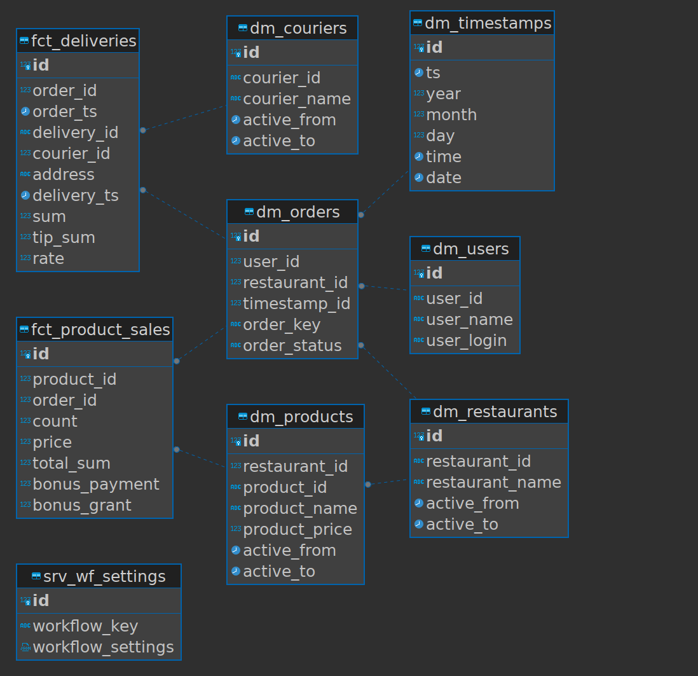

## Data Model Description

### Dimensions:

1. **dm_couriers**
   - Attributes: `courier_id`, `courier_name`, `active_from`, `active_to`

2. **dm_orders**
   - Attributes: `order_key`, `order_status`
   - Foreign Keys: `user_id` (references dm_users), `restaurant_id` (references dm_restaurants), `timestamp_id` (references dm_timestamps)

3. **dm_products**
   - Attributes: `product_id`, `product_name`, `product_price`, `active_from`, `active_to`
   - Foreign Key: `restaurant_id` (references dm_restaurants)

4. **dm_restaurants**
   - Attributes: `restaurant_id`, `restaurant_name`, `active_from`, `active_to`

5. **dm_timestamps**
   - Attributes: `ts`, `year`, `month`, `day`, `time`, `date`

6. **dm_users**
   - Attributes: `user_id`, `user_name`, `user_login`

### Facts:

1. **fct_deliveries**
   - Attributes: `delivery_id`, `order_ts`, `delivery_ts`, `address`, `sum`, `tip_sum`, `rate`
   - Foreign Keys: `order_id` (references dm_orders), `courier_id` (references dm_couriers)

2. **fct_product_sales**
   - Attributes: `count`, `price`, `total_sum`, `bonus_payment`, `bonus_grant`
   - Foreign Keys: `product_id` (references dm_products), `order_id` (references dm_orders)

3. **srv_wf_settings**
   - Attributes: `workflow_key`, `workflow_settings`

In this data model, the tables with descriptive attributes represent dimensions, and tables that store measurable and numeric data represent facts.
Dimensions provide context and descriptive information, while facts store quantifiable data that can be aggregated.
